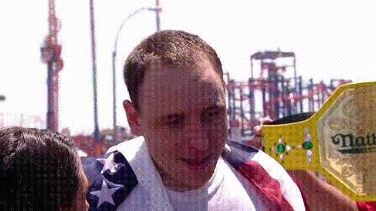

Per camp tradition, we'll be screening the yearly Nathan's Hot Dog Eating Contest on the 4th of July. All campers are welcome and attendees will receive a complimentary hot dog along with the cold beverage of their choice.

Camp opens at 1 PM (as does the grill) and the Nathan's screening will start soon after. Some of the camp staff will be observing holiday hours mid-afternoon, but counselor Brian is committed to keeping the spirit of gluttony going as long as necessary.
 
We'd also like to remind campers not to attempt to duplicate the work of competitive eaters if they haven't been training.