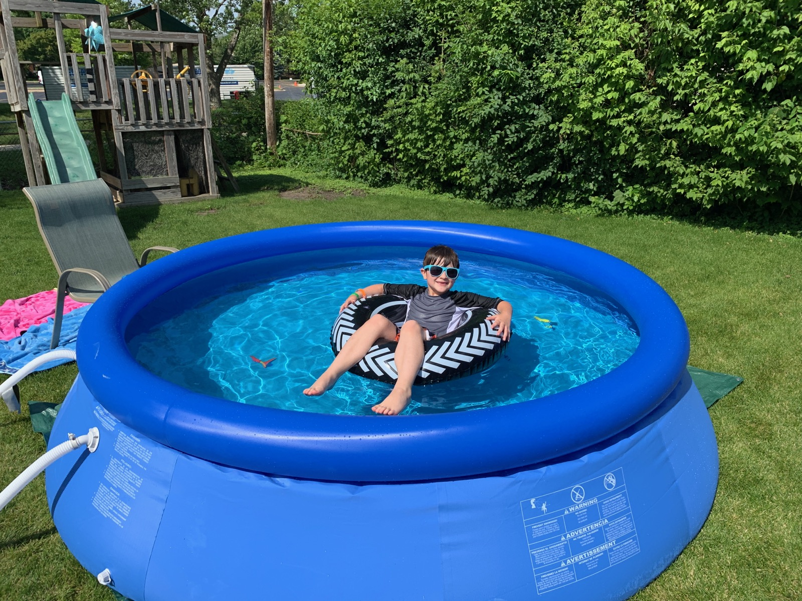

The time has come for one of the biggest events of the camp season - the yearly screening of the  Nathan's Hot Dog Eating Contest on the 4th of July. As an added bonus, we'll also be screening the new 30 for 30 documentary [The Good, The Bad, and The Hungry](https://www.espn.com/video/clip/_/id/26840122) because there is so much more to learn about competitive eating.

Camp opens at 1:30 PM and both the pool and the grill will be open for the day. Come for the crowning of a champion, stay for a hot dog, a beverage, or a swim (but please note camp has a strict no swiming until 15 miniutes after eating policy.)

"America!" - Grillmaster, Brewmaster and Webmaster Brian Perry