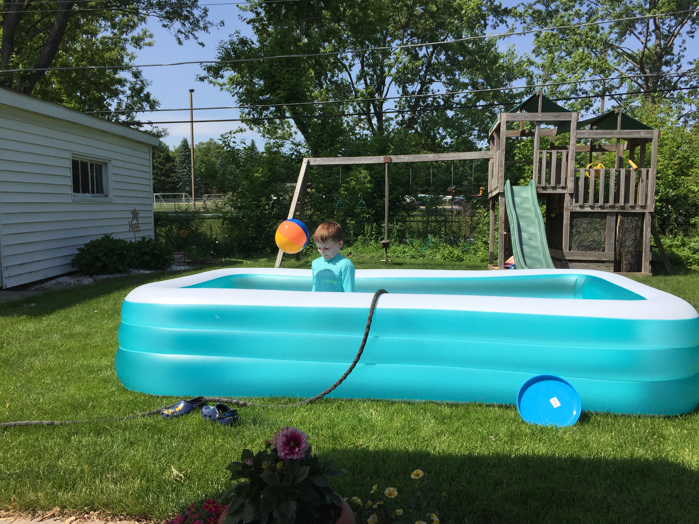

While school is out and camp is in, we've been experiencing a slow start to the season at Camp Perry.

First off, the weather hasn't really been all that warm. That hasn't stopped our associate camp director from demanding that the pool be inflated and filled. It all resulted in what he described as 'the coldest swim ever.'

On top of that, we've experienced some flooding due to rain in the front courtyard. As you can see from the photo above, it has had some impact on our early season Nerf dart competitions.

Last and most concerning, we had an incident with our picnic table that has rendered it slightly less useful. We're now looking at non-glass options and have implemented a strict policy that requires patio umbrellas to stay closed on windy days. The picnic table will be missed, but the good times we had will never be forgotten.

Forcasts indicate that temperatures will be turning more seaonally appropriate, and with any luck camp activities will kick back into full swing as a result.

As always, thanks for choosing Camp Perry.